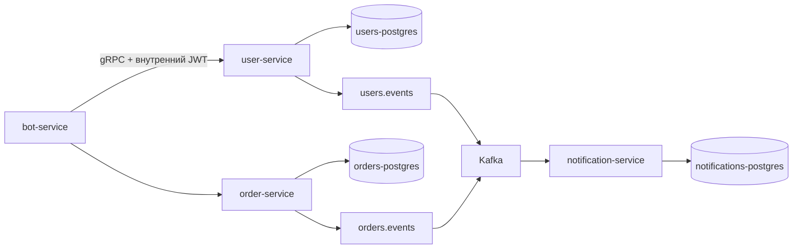

# Платформа управления заказами

Production-like Go monorepo для управления заказами и исполнителями. В текущей версии есть базовая структура репозитория, версионированные protobuf-контракты, три набора SQL-миграций, Docker Compose-топология, а также User Service, Order Service и outbox workers. Bot Service и Notification Service пока остаются компилируемыми HTTP-entrypoint’ами с корректным graceful shutdown до этапа их полной реализации.

## Запуск

Скопируйте `.env.example` в `.env`, установите непубличный `JWT_SECRET`, затем выполните `docker compose up --build`.

Миграции запускаются в одноразовых контейнерах и завершаются до запуска соответствующих сервисов. User Service доступен по gRPC на `localhost:50051`, Order Service — на `localhost:50052`. Метрики и health endpoints доступны на `localhost:8081` и `localhost:8082` соответственно. Prometheus доступен на `localhost:9090`, Grafana — на `localhost:3000` с учётными данными по умолчанию `admin` / `admin`.

Локальные команды: `make test`, `make build`, `make proto`, `make migrate-up`. Сгенерированный protobuf-код находится в `gen/go`, поэтому сборка приложения не требует установленного `protoc`.

## User Service

Контракт `proto/user/v1/user.proto` описывает аутентификацию, поиск и список пользователей, создание и обновление, permissions, активацию, управление паролями и привязку Telegram. Пароли хешируются Argon2id; открытый пароль не сохраняется и не логируется.

Каждое изменение пользователя добавляет JSON-envelope `pkg/event.Envelope` в `users.outbox_events` в той же PostgreSQL-транзакции, что и изменение состояния. `user-outbox-worker` выбирает события пакетами с `FOR UPDATE SKIP LOCKED` и публикует их в `users.events`.

Аутентификация публична; остальные User RPC требуют HMAC-подписанный внутренний JWT в metadata: `authorization: Bearer <token>`. Interceptor проверяет подпись и срок действия, после чего сохраняет actor в `context.Context`.

## Order Service

Контракт `proto/order/v1/order.proto` поддерживает создание, чтение, обновление, смену статуса, назначение и снятие исполнителя, списки и историю изменений. Сервис проверяет internal JWT и permissions, использует optimistic locking через `expected_version`, запрещает недопустимые переходы статусов и проверяет исполнителя через User Service по gRPC.

Изменения заказа, история аудита `order_history` и события `outbox_events` записываются в одной транзакции. `order-outbox-worker` публикует сообщения в `orders.events` аналогично пользовательскому worker.

## Границы баз данных и будущий API

Каждый сервис владеет только собственным PostgreSQL-контейнером. В `migrations/orders` намеренно нет внешнего ключа на пользователей: идентификаторы исполнителей являются ссылками уровня приложения. Будущий REST-контракт административного API зафиксирован в `docs/openapi.yaml`; gRPC остаётся внутренним контрактом бизнес-сервисов.

Kafka работает в режиме ZooKeeper и настроен для локальной разработки. Сообщения используют ID агрегата в качестве Kafka key, чтобы сохранять порядок событий одного агрегата. Основные топики: `users.events`, `orders.events`, а также соответствующие DLQ-топики `users.events.dlq` и `orders.events.dlq`.
