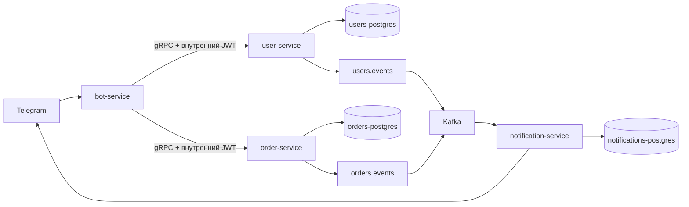

# Платформа управления заказами

Go-монорепозиторий для управления заказами, исполнителями и уведомлениями в Telegram. Платформа состоит из User Service, Order Service, фоновых outbox-воркеров, Notification Service и Telegram Bot Service.



## Быстрый запуск

1. Создайте локальный файл настроек:

   ```powershell
   Copy-Item .env.example .env
   ```

2. В `.env` задайте:

   - `TELEGRAM_BOT_TOKEN` — токен бота из BotFather;
   - `JWT_SECRET` — длинный случайный секрет.

   Файл `.env` игнорируется Git. Не публикуйте токен или секрет.

3. Запустите платформу:

   ```powershell
   docker compose up -d --build
   ```

4. Проверьте состояние:

   ```powershell
   docker compose ps
   ```

Для обычной остановки с сохранением данных используйте `docker compose stop`. Команда `docker compose down` удаляет контейнеры и сеть, но данные PostgreSQL сохраняются в именованных Docker-томах. Чтобы удалить данные намеренно, выполните `docker compose down -v`.

Миграции выполняются одноразовыми контейнерами до запуска сервисов. Локальные точки доступа:

| Компонент | Адрес |
| --- | --- |
| User Service gRPC | `localhost:50051` |
| Order Service gRPC | `localhost:50052` |
| Метрики/health User Service | `http://localhost:8081` |
| Метрики/health Order Service | `http://localhost:8082` |
| Prometheus | `http://localhost:9090` |
| Grafana | `http://localhost:3000` (`admin` / `admin`) |

## Работа с Telegram-ботом

Бот получает обновления через long polling — публичный webhook не нужен. Контейнеру требуется исходящий HTTPS-доступ к `api.telegram.org:443`.

### Привязка аккаунта

Пользователь привязывает свой Telegram-аккаунт командой:

```text
/start <логин> <пароль>
```

Например: `/start ivanov пароль`. Пароль используется только для аутентификации на этапе привязки и не сохраняется ботом. Отправляйте его только в личный чат с ботом, а не в группу.

### Команды исполнителя

| Команда | Назначение |
| --- | --- |
| `/orders` | Показать свои активные заказы. |
| `/help` | Показать справку по командам. |
| `/cancel` | Отменить незавершённый сценарий. |

Исполнитель получает Telegram-уведомление, когда ему назначается заказ или заказ изменяется. Уведомление сначала сохраняется в базе Notification Service, поэтому временная недоступность Telegram не приводит к потере записи о нём.

### Команды администратора

Администратор имеет команды исполнителя и следующие дополнительные возможности:

| Команда | Назначение |
| --- | --- |
| `/neworder` | Создать заказ пошагово. |
| `/editorder <ID>` | Изменить существующий заказ пошагово. |
| `/ordersdate ДД.ММ.ГГГГ` | Показать все заказы на указанную дату. |
| `/newuser` | Создать пользователя с ролью `admin` или `performer`. |

Во время создания заказа бот последовательно запрашивает дату и время, адрес, сумму, данные клиента, комментарий и исполнителей. Логины нескольких исполнителей указываются через запятую; `-` означает создать заказ без назначения. После проверки отправьте `/confirm`, либо `/cancel` для отмены.

При `/newuser` бот запрашивает логин, полное имя и роль, затем после `/confirm` создаёт пользователя и показывает одноразово сгенерированный пароль. Передайте его пользователю безопасным способом. Этот пароль используется для его первой команды `/start`.

При `/editorder <ID>` бот по очереди предлагает заменить каждое поле. Отправьте `-`, чтобы оставить текущее значение, затем подтвердите изменения командой `/confirm`.

Черновики сценариев хранятся в Redis 30 минут. Новый сценарий можно в любой момент отменить `/cancel`.

## Роли и доступ

Права проверяются сервисами, а не только интерфейсом Telegram.

| Роль | Доступ |
| --- | --- |
| `performer` | Просмотр только собственных активных заказов и получение уведомлений. |
| `admin` | Создание и редактирование заказов, просмотр всех заказов за дату, создание пользователей и возможности исполнителя. |

## Сервисы и данные

Каждый сервис владеет отдельной базой PostgreSQL. Order Service использует optimistic locking (`expected_version`) при изменении заказа и ведёт аудит в `order_history`.

Изменение пользователя или заказа записывается вместе с событием в outbox-таблицу в одной транзакции. Воркеры публикуют эти события в Kafka: `users.events` и `orders.events`; для ошибочных сообщений предусмотрены `users.events.dlq` и `orders.events.dlq`. Notification Service читает события, сохраняет уведомления и отправляет их привязанным активным исполнителям.

## Разработка

```powershell
make test
make build
make proto
make migrate-up
```

Protobuf-код уже сгенерирован в `gen/go`, поэтому для обычной сборки `protoc` не требуется. Контракты сервисов находятся в `proto/`, а описание планируемого административного HTTP API — в `docs/openapi.yaml`.
