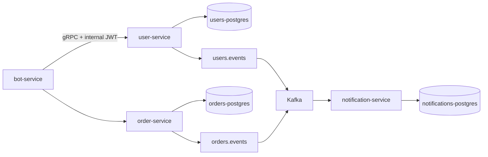

# Order platform

Production-like Go monorepo for orders and performers. This initial increment contains the repository foundation, versioned protobuf contracts, all three database migration sets, Docker Compose topology, and a functional User Service. Order, notification, bot, and outbox-worker applications deliberately remain compilable, graceful HTTP entrypoints until their implementation phase.

## Run

Copy `.env.example` to `.env`, set a non-development `JWT_SECRET`, then run `docker compose up --build`. Migrations are one-shot containers and complete before User Service starts. The service exposes gRPC on `localhost:50051`, metrics on `localhost:8081/metrics`, and liveness/readiness endpoints on that same HTTP port. Prometheus is at `localhost:9090`; Grafana is at `localhost:3000` (default `admin` / `admin`).

Run `make test`, `make build`, `make proto`, and `make migrate-up` locally. Generated code is committed under `gen/go` so an application build does not require `protoc`.

## User Service

`proto/user/v1/user.proto` defines authentication, lookup, list, create/update, permissions, activation, password management, and Telegram binding. Passwords use Argon2id; the plaintext is never persisted or logged. User writes append a common JSON `pkg/event.Envelope` to `users.outbox_events` inside the same PostgreSQL transaction as the state change. A later `user-outbox-worker` will publish the envelope to `users.events` using `FOR UPDATE SKIP LOCKED`.

Authentication is public; all other User RPCs require an HMAC-signed internal JWT in `authorization: Bearer <token>`. The reusable interceptor extracts the actor into context and validates signature and expiry. Permission-level authorization will be applied when the bot/admin adapters are introduced, along with an explicit initial-admin bootstrap flow.

## Database boundaries and future API

Each service owns only its own PostgreSQL container. `migrations/orders` intentionally has no foreign key to users; performer IDs are application-level references. `docs/openapi.yaml` preserves the requested future REST administrative routes, while gRPC stays the business-service contract.

Kafka runs in ZooKeeper mode and is configured for local development. Events use aggregate IDs as Kafka keys when workers are implemented; expected topics are `users.events`, `orders.events`, and their `.dlq` counterparts.
